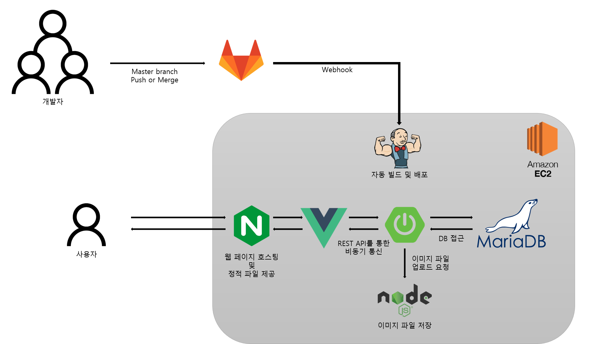

# 웹/모바일(웹 디자인) 스켈레톤 프로젝트

<!-- 필수 항목 -->

## 카테고리

| Application | Domain | Language | Framework |
| ---- | ---- | ---- | ---- |
| :black_square_button: Desktop Web | :black_square_button: AI | :white_check_mark: JavaScript | :white_check_mark: Vue.js |
| :white_check_mark: Mobile Web | :black_square_button: Big Data | :black_square_button: TypeScript | :black_square_button: React |
| :black_square_button: Responsive Web | :black_square_button: Blockchain | :black_square_button: C/C++ | :black_square_button: Angular |
| :black_square_button: Android App | :black_square_button: IoT | :black_square_button: C# | :black_square_button: Node.js |
| :black_square_button: iOS App | :black_square_button: AR/VR/Metaverse | :black_square_button: Python | :white_check_mark: Flask/Django |
| :black_square_button: Desktop App | :black_square_button: Game | :white_check_mark: Java | :white_check_mark: Spring/Springboot |
| | | :black_square_button: Kotlin | |

<!-- 필수 항목 -->

## 프로젝트 소개

* 프로젝트명: 우리사자
* 서비스 특징 및 주요기능
  - 비슷한 지역에서 공동 구매를 통해 내가 필요한만큼, 더 싸게 구매하기!
  - 돈 관련하여 우리 사이트가 중간에서 물건을 수령하면 돈이 전달되도록 하여 안전성 확보하기!
  - 각 사용자마다 신뢰 등급, 댓글보기, 후기를 통해 사용자의 신뢰성 확인하기!
  - 서드 파티를 통한 계정 관리
  - 공동 구매를 희망하는 사람들끼리 파티를 맺을 수 있도록 플랫폼 제공
* 주요 기술
  - Vue
  - Spring boot
  - JPA
  - Rest API
<!-- 자유 양식 -->

## 팀 소개
- 김현수 : Front-end(main), 팀장
- 박상우 : Back-end(main)
- 박소진 : Back-end(sub)
- 윤지영 : Full-stack
- 장영하 : Back-end(sub), 부팀장
- 최윤석 : Front-end(sub)

<!-- 자유 양식 -->
## 프로젝트 상세 설명
// 개발 환경, 기술 스택, 시스템 구성도, ERD, 기능 상세 설명 등

## 아키텍처 구성

